# Análise Comparativa de Algoritmos de Ordenação Não-Comparativos e Híbridos em Múltiplos Paradigmas de Programação

[](https://www.linux.org/)
[](https://en.wikipedia.org/wiki/C_(programming_language))
[](https://isocpp.org/)
[](https://golang.org/)
[](https://www.rust-lang.org/)
[](https://www.haskell.org/)
[](https://www.python.org/)
[](https://github.com)
[](LICENSE)

---


## 📋 Sumário Executivo

Este repositório contém uma análise experimental rigorosa de algoritmos de ordenação não-comparativos e híbridos, implementados em cinco linguagens de programação distintas (**C**, **C++**, **Go**, **Haskell** e **Rust**) com diferentes paradigmas e runtime characteristics. O projeto concentra-se em investigar o impacto da linguagem de programação, do paradigma computacional e das características de runtime na performance prática de algoritmos bem-estabelecidos teoricamente.

O trabalho é orientado por objetivos acadêmicos rigorosos: validar complexidade teórica via experiência, quantificar overhead de runtimes, comparar eficiência entre linguagens compiladas e interpretadas, e fornecer insights sobre trade-offs entre simplicidade algorítmica e overhead de abstração.

---

## 🔍 Índice de Navegação

- [Objetivos Acadêmicos](#-objetivos-acadêmicos)
- [Estrutura do Projeto](#-estrutura-do-projeto)
- [Algoritmos Estudados](#-algoritmos-estudados)
- [Como Compilar](#-como-compilar)
- [Como Executar](#-como-executar)
- [Resultados Experimentais](#-resultados-experimentais)
- [Limitações](#-limitações-do-projeto)
- [Referências](#-referências-académicas)

---

## 🎯 Objetivos Acadêmicos

### Análise Teórica vs. Prática

- **Validação experimental** da complexidade assintótica: $\mathcal{O}(n+k)$ para Counting Sort, $\mathcal{O}(d \cdot n)$ para Radix Sort, $\mathcal{O}(n \log n)$ com $\mathcal{O}(\log n)$ limite de recursão para IntroSort
- **Quantificação de overhead**: custo de abstrações linguísticas, garbage collection, compilação JIT (quando aplicável)
- **Análise de escalabilidade**: comportamento em datasets de $10^2$ a $10^7$ elementos

### Comparação Inter-linguagem

- Isolamento de fatores como **tempo de compilação**, **otimizações do compilador**, **características de runtime**
- Impacto de **garbage collection** (Haskell) vs. **memory management explícito** (C, C++, Rust)
- Overhead de **abstrações linguísticas** e **type systems** (especialmente Haskell com tipos polimórficos)

### Engenharia Experimental

- Metodologia robusta de benchmarking com **múltiplas execuções** e **datasets variados**
- Coleta de métricas de **tempo de wall-clock** e **pico de memória residente**
- Variação sistemática de padrões de entrada: aleatório, crescente, decrescente

### Impacto de Características Algorítmicas

- **Dependência de valores** em algoritmos não-comparativos: custo proporcional a $k$ (range de valores)
- **Estabilidade** e trade-offs com complexidade espaço-temporal
- **Comportamento no melhor/pior caso** em relação à distribuição de dados

---

## 🔬 Algoritmos Estudados

### 1. Counting Sort

#### Fundamentação Teórica

Counting Sort é um algoritmo de ordenação **não-comparativo**, **estável**, que opera sob a premissa de que os elementos a ordenar são inteiros dentro de um intervalo conhecido $[0, k]$.

**Paradigma**: Distribução (Bucket-based)  
**Complexidade Temporal**: $\mathcal{O}(n + k)$  
**Complexidade Espacial**: $\mathcal{O}(n + k)$  
**Estabilidade**: Sim (mantém ordem relativa de elementos iguais)  
**In-place**: Não (requer arrays auxiliares)

#### Algoritmo

1. Criar array de contagem $C$ de tamanho $k+1$, inicializado com zeros
2. Iterar sobre a entrada, incrementando $C[\text{elemento}]$
3. Acumular: $C[i] = C[i] + C[i-1]$ para determinar posições finais
4. Iterar sobre entrada em **reverso**, posicionando cada elemento em sua posição final via $C[\text{elemento}]$

#### Implementação

- **C**: malloc/free explícito, pointers para lista auxiliar
- **C++**: vectors com reserva pré-alocada
- **Go**: slices com capacidade pré-definida
- **Rust**: Vec com capacidade pré-alocada
- **Haskell**: lista funcional com acúmulos (monádicos ou puramente funcionais)

#### Cenários Ideais

- $k \ll n$ (range pequeno comparado ao tamanho da entrada)
- Distribuições densas de valores
- Quando **estabilidade** é crítica
- Dados inteiros ou inteiros mapeados

#### Limitações

- Não funciona com valores negativos (sem pré-processamento)
- Degradação quando $k > n$ (overhead do array de contagem)
- Uso significativo de memória para ranges grandes

---

### 2. Radix Sort

#### Fundamentação Teórica

Radix Sort é um algoritmo de ordenação **não-comparativo**, **estável**, que estende Counting Sort processando números dígito-a-dígito (LSD: Least Significant Digit em todas as implementações).

**Paradigma**: Distribução (Digit-based)  
**Complexidade Temporal**: $\mathcal{O}(d \cdot n)$ onde $d$ é número de dígitos  
**Complexidade Espacial**: $\mathcal{O}(n + 10)$ (10 = número de dígitos decimais)  
**Estabilidade**: Sim (depende de Counting Sort ser estável)  
**In-place**: Não

#### Algoritmo (LSD - Least Significant Digit)

1. Para cada dígito $e = 10^0, 10^1, 10^2, \ldots$:
   - Aplicar Counting Sort **estável** sobre dígito na posição $e$
   - Usar fórmula: dígito = $\lfloor \text{elemento} / e \rfloor \mod 10$
2. Após processar todos os $d$ dígitos, array está ordenado

#### Otimização em C

Usa **troca de pointers** entre arrays principais e auxiliares, evitando cópias repetidas.

#### Cenários Ideais

- $d$ é pequeno (números com poucas dezenas)
- $k > n$ (onde Counting Sort seria ineficiente)
- Distribuições uniformes de dígitos
- Quando **estabilidade** e **distribuição uniforme** são garantidas

#### Limitações

- Pior caso: $d \approx \log_{10} k$, então complexidade torna-se $\mathcal{O}(n \log k)$
- Overhead em valores pequenos ($d=1$ → praticamente Counting Sort)
- Não trata números negativos diretamente (seria necessário mapear)

---

### 3. Introsort (Hybrid: Quicksort + Heapsort + Insertion Sort)

#### Fundamentação Teórica

Introsort (Introspective Sort) é um algoritmo **híbrido** que combina três ordenadores para obter garantias de complexidade $\mathcal{O}(n \log n)$ **no pior caso**, diferentemente de Quicksort clássico.

**Paradigma**: Hybrid (Quicksort → Heapsort → Insertion Sort)  
**Complexidade Temporal**: $\mathcal{O}(n \log n)$ garantido  
**Complexidade Espacial**: $\mathcal{O}(\log n)$ (recursão implícita)  
**Estabilidade**: Não (comparadores podem trocar elementos iguais)  
**In-place**: Sim

#### Algoritmo

```
introsort(arr, início, fim, profundidade_limite):
  tamanho ← fim - início + 1
  
  if tamanho < 16:
    insertion_sort(arr, início, fim)
    return
  
  if profundidade_limite == 0:
    heap_sort(arr, início, fim)
    return
  
  pivô ← partition(arr, início, fim)  // Quicksort tradicional
  introsort(arr, início, pivô-1, profundidade_limite-1)
  introsort(arr, pivô+1, fim, profundidade_limite-1)
```

#### Estratégia

1. **Profundidade Limite**: $2 \times \lfloor \log_2 n \rfloor$ → impede degradação de Quicksort
2. **Insertion Sort**: otimização para pequenos sub-arrays ($< 16$ elementos)
3. **Heap Sort**: garantia de $\mathcal{O}(n \log n)$ quando Quicksort degrada
4. **Pivot**: primeiro elemento do sub-array (simples, variações usam mediana-de-três)

#### Cenários Ideais

- **Não há suposições sobre os dados** (comparison-based, funciona com qualquer tipo ordenável)
- Garantia hard de $\mathcal{O}(n \log n)$ necessária
- Dados com comportamento adversarial (quase-ordenados, muitos duplicados)
- Uso em STL (`std::sort` em C++ usa Introsort)

#### Limitações

- Mais lento que Quicksort em caso médio com dados aleatórios (overhead de profundidade)
- Não é estável (perda de ordem relativa)
- Constantes maiores que algoritmos simples para $n$ pequeno

---

## 📊 Comparação Teórica

| Característica | Counting Sort | Radix Sort | Introsort |
|:---|:---:|:---:|:---:|
| **Tipo** | Não-comparativo | Não-comparativo | Comparativo/Híbrido |
| **Melhor Caso** | $\mathcal{O}(n+k)$ | $\mathcal{O}(dn)$ | $\mathcal{O}(n\log n)$ |
| **Caso Médio** | $\mathcal{O}(n+k)$ | $\mathcal{O}(dn)$ | $\mathcal{O}(n\log n)$ |
| **Pior Caso** | $\mathcal{O}(n+k)$ | $\mathcal{O}(dn)$ | $\mathcal{O}(n\log n)$ |
| **Espaço** | $\mathcal{O}(n+k)$ | $\mathcal{O}(n+r)$ | $\mathcal{O}(\log n)$ |
| **Estável** |  Sim |  Sim |  Não |
| **In-place** |  Não |  Não |  Sim |
| **Adapt. Crescente** |  Não |  Não |  Sim |
| **Adapt. Decrescente** |  Não |  Não |  Parcial |
| **Quando Usar** | $k \ll n$, estabilidade crítica | $d$ pequeno, $k > n$ | Dados arbitrários, pior caso crítico |

---


## 📁 Estrutura do Projeto

```
Algoritmos-de-Ordenacao/
├── README.md                           # Este arquivo
├── Makefile                            # Build system para todas as linguagens
│
├── metodosOrdenacao/                   # Código-fonte por linguagem
│   ├── C/
│   │   ├── main.c                      # Entry point C
│   │   ├── problema.{c,h}              # Input/Output management
│   │   ├── counting/
│   │   │   ├── counting.c
│   │   │   └── counting.h
│   │   ├── radix/
│   │   │   ├── radix.c
│   │   │   └── radix.h
│   │   └── introsort/
│   │       ├── introsort.c
│   │       └── introsort.h
│   │
│   ├── CPP/
│   │   ├── main.cpp
│   │   ├── problema.{cpp,hpp}
│   │   └── [counting/, radix/, introsort/]  # Estrutura similar
│   │
│   ├── GO/
│   │   ├── main.go
│   │   ├── go.mod
│   │   ├── problema.go
│   │   └── [counting/, radix/, introsort/]
│   │
│   ├── RUST/
│   │   ├── Cargo.toml
│   │   ├── Cargo.lock
│   │   ├── main.rs
│   │   ├── problema.rs
│   │   └── [counting/, radix/, introsort/]
│   │
│   └── HASKELL/
│       ├── HASKELL.cabal
│       ├── LICENSE
│       ├── app/
│       │   └── Main.hs
│       └── src/
│           ├── Problema.hs
│           ├── Counting/
│           ├── Radix/
│           └── Introsort/
│
├── inputs/                             # Conjuntos de dados
│   ├── inputgenerator.py              # Script para gerar inputs aleatórios
│   ├── inputorder.py                  # Script para gerar variantes (crescente/decrescente)
│   ├── input1.dat até input6.dat      # Dados aleatórios (100, 1K, 10K, 100K, 1M, 10M)
│   ├── input*_cord.dat                # Variantes crescentes (cord = crescente ordem)
│   └── input*_dord.dat                # Variantes decrescentes (dord = decrescente ordem)
│
├── outputs/                            # Resultados de execução
│   ├── InputRandom/                    # Outputs de entrada aleatória
│   ├── InputCord/                      # Outputs de entrada crescente
│   └── InputDord/                      # Outputs de entrada decrescente
│
├── builds/                             # Binários compilados
│   ├── main_c
│   ├── main_cpp
│   ├── main_go
│   ├── main_rs
│   └── HASKELL
│
├── benchmarks/                         # Dados brutos de benchmark
│   ├── COUNTING/
│   │   ├── benchmark_c_*.txt
│   │   ├── benchmark_cpp_*.txt
│   │   ├── benchmark_go_*.txt
│   │   ├── benchmark_hs_*.txt
│   │   └── benchmark_rs_*.txt
│   ├── RADIX/
│   │   └── [estrutura similar]
│   └── INTROSORT/
│       └── [estrutura similar]
│
└── comparacoes/                        # Scripts e gráficos de análise
    ├── plot_time.py                   # Gera gráficos de tempo (9 variações)
    ├── plot_memory.py                 # Gera gráficos de memória (8 variações)
    ├── tempo_graficos/
    │   ├── tempo_algoritmos_combinado.png
    │   ├── tempo_[algoritmo].png      # 3 gráficos (Radix, Counting, Introsort)
    │   ├── tempo_[linguagem].png      # 5 gráficos (C, C++, Go, Haskell, Rust)
    │   └── tempo_benchmarks.csv
    ├── memoria_graficos/
    │    └── [estrutura similar aos tempo_graficos/]
    └── banner.png                      # Banner para README e apresentações
```

### Estatísticas da Estrutura

- **Implementações**: 5 linguagens × 3 algoritmos = **15 implementações**
- **Arquivos de código-fonte**: ~45 arquivos (.c, .cpp, .go, .rs, .hs)
- **Datasets**: 6 tamanhos × 3 variações (aleatório, crescente, decrescente) = **18 arquivos .dat**
- **Outputs**: 50+ arquivos de resultado por linguagem/algoritmo
- **Benchmarks brutos**: 200+ arquivos .txt

---

## 🛠️ Tecnologias Utilizadas

### Linguagens e Compiladores

| Linguagem | Versão | Compilador | Flags de Otimização |
|:---|:---:|:---|:---|
| **C** | C99/C11 | `gcc` (GNU) | `-lm` (math library) |
| **C++** | C++11 | `g++` (GNU) | padrão |
| **Go** | 1.26.2 | `go build` | release build |
| **Rust** | 2021 edition | `cargo` | `--release` (LTO, opt-level=3) |
| **Haskell** | GHC via Cabal | `cabal install` | otimizado por padrão |

### Ferramentas de Análise

- **Medição de Tempo**: `/usr/bin/time -v` (GNU time com estatísticas detalhadas)
- **Medição de Memória**: 
  - C/C++/Go/Rust: `Maximum resident set size` via `/usr/bin/time -v`
  - Haskell: RTS (Runtime System) flag `+RTS -s` para profiling
- **Visualização**: Python 3 com `matplotlib`, `numpy`
- **Processamento**: Python `csv`, `argparse`, `collections.defaultdict`

### Dependências

- **C/C++**: `math.h` (via `-lm`)
- **Go**: stdlib (time, fmt, math/rand)
- **Rust**: stdlib (std::time)
- **Haskell**: 
  - `Data.Time.Clock` (medição de tempo)
  - `Control.DeepSeq` (força avaliação)
  - `Data.List` (operações)
  - `Data.IORef` (referências mutáveis em Haskell puro)
- **Python**: `matplotlib`, `numpy`, `tqdm` (progress bars)

---

## 🔧 Ambiente Experimental

### Plataforma

- **Sistema Operacional**: Windows 11 com WSL2 (ambiente Linux virtualizado)
- **Arquitetura**: x86-64
- **Suporte de Hardware**: SSE, AVX (não explicitamente usados, mas disponíveis)

### Especificações de Hardware

| Componente | Especificação |
|:---|:---|
| **CPU** | AMD Ryzen 5 4600G (6 cores / 12 threads, 3.7-4.2 GHz) |
| **GPU** | NVIDIA GeForce RTX 3050 (8 GB GDDR6) |
| **RAM** | 16 GB DDR4 2666 MHz |
| **Armazenamento** | SSD NVMe 512 GB |
| **Sistema Operacional** | Windows 11 + WSL2 (Ubuntu 22.04 LTS) |

#### Observações sobre a Plataforma

- **WSL2**: Virtualização Hyper-V; impacto negligenciável em computação CPU-bound (~2-5% overhead)
- **AMD Ryzen 5 4600G**: APU (integra Radeon iGPU), não utilizada neste projeto
- **RTX 3050**: Potencial para future work com CUDA (não implementado nesta análise)
- **Cache**: L1: 384 KB, L2: 3 MB, L3: 16 MB (configuração típica Zen 3)
- **TDP**: 35W (APU de baixo consumo) + GPU dedicada

### Metodologia de Benchmarking

#### 1. Geração de Dados

Scripts Python geram datasets com controle fino:

```bash
# Entrada aleatória (uniform random)
python inputs/inputgenerator.py

# Parâmetros configuráveis:
entrada = 10^7          # tamanho
valor_minimo = 1        # range mínimo
valor_maximo = 10^4     # range máximo
arquivo_saida = 'inputs/input7.dat'
random.seed(42)         # reprodutibilidade
```

```bash
# Variantes (crescente e decrescente)
python inputs/inputorder.py
# input_alvo = '6'  → lê input6.dat e cria:
# - input6_cord.dat (crescente ordenado)
# - input6_dord.dat (decrescente ordenado)
```

**Tamanhos de Dataset**:
- input1: $10^2$ (100 elementos)
- input2: $10^3$ (1K elementos)
- input3: $10^4$ (10K elementos)
- input4: $10^5$ (100K elementos)
- input5: $10^6$ (1M elementos)
- input6: $10^7$ (10M elementos)

#### 2. Métricas Coletadas

**Tempo**:
- Tempos de wall-clock **por execução** (múltiplas para média e desvio)
- Implementações executam **20 vezes** por dataset, tempo = média

**Memória**:
- Pico de RSS (Resident Set Size) durante execução
- Coletado via `/usr/bin/time -v` ou Haskell RTS

#### 3. Estratégia de Execução

```makefile
# Via Makefile, múltiplas execuções com timestamps únicos
TIMES ?= 1

define run_times
  @for i in $(shell seq 1 $(TIMES)); do \
    TS=$$(date +%Y%m%d_%H%M%S)_$$(cat /proc/sys/kernel/random/uuid | cut -c1-8); \
    /usr/bin/time -v ./binary 2>benchmarks/benchmark_lang_$$TS.txt; \
  done
endef

# Exemplo: make c_benchmark TIMES=6
```

---

## 🔨 Como Compilar

### Pré-requisitos

```bash
# Ubuntu/Debian
sudo apt-get install build-essential gcc g++ golang-go rustc cargo ghc cabal-install

# Verificação rápida
gcc --version          # GNU C compiler
g++ --version          # GNU C++ compiler
go version             # Go compiler
rustc --version        # Rust compiler
ghc --version          # Haskell compiler
```

### Compilação Individual

#### C
```bash
# Compilação manual (via Makefile)
make c

# Output: builds/main_c

# Compilação manual direta:
gcc metodosOrdenacao/C/*.c \
    metodosOrdenacao/C/counting/*.c \
    metodosOrdenacao/C/introsort/*.c \
    metodosOrdenacao/C/radix/*.c \
    -I metodosOrdenacao/C \
    -I metodosOrdenacao/C/counting \
    -I metodosOrdenacao/C/introsort \
    -I metodosOrdenacao/C/radix \
    -o builds/main_c -lm
```

#### C++
```bash
make cpp

# Output: builds/main_cpp

# Compilação manual:
g++ metodosOrdenacao/CPP/*.cpp \
    metodosOrdenacao/CPP/counting/*.cpp \
    metodosOrdenacao/CPP/introsort/*.cpp \
    metodosOrdenacao/CPP/radix/*.cpp \
    -I metodosOrdenacao/CPP \
    -I metodosOrdenacao/CPP/counting \
    -I metodosOrdenacao/CPP/introsort \
    -I metodosOrdenacao/CPP/radix \
    -o builds/main_cpp
```

#### Go
```bash
make go

# Output: builds/main_go

# Compilação manual:
cd metodosOrdenacao/GO
go build -o ../../builds/main_go .
```

#### Rust
```bash
make rs

# Output: builds/main_rs

# Compilação manual:
cd metodosOrdenacao/RUST
cargo build --release
cp target/release/RUST ../../builds/main_rs
```

#### Haskell
```bash
make hs

# Output: builds/HASKELL

# Compilação manual:
cd metodosOrdenacao/HASKELL
cabal install --installdir=../../builds --overwrite-policy=always
```

#### Todos de uma vez
```bash
make all

# Compila C, C++, Go, Haskell e Rust sequencialmente
```

---

## ▶️ Como Executar

### Execução Interativa

Cada implementação suporta **menu interativo** em tempo de execução:

```bash
# Exemplo com C
./builds/main_c

# Menu exibirá:
# 1. Escolha do Input (1-6)
# 2. Escolha do Algoritmo (Counting Sort, Radix Sort, Introsort, Todos)
# 3. Número de execuções (para média)

# Escolha 6 (TODOS), 1 (input1.dat), 10 (execuções)
# Output gerado: outputs/outputRadix Sort1234567890.dat, etc.
```

### Execução via Makefile (Recomendado)

```bash
# Execução simples (1 execução)
make c_run      # C
make cpp_run    # C++
make go_run     # Go
make hs_run     # Haskell
make rs_run     # Rust

# Múltiplas execuções para média
make c_run TIMES=10

# Rodar todas as linguagens
make all
./builds/main_c    # após compilação bem-sucedida
```

### Coleta de Saída

Cada execução gera arquivo .dat em `outputs/`:

```
outputs/outputAlgoritmo1234567890.dat

Conteúdo típico:
─────────────────────────────────────
Linguagem: C
Algoritmo: Counting Sort
Input: inputs/input3.dat
Tempos de execução (em segundos):
Execução 1: 0.000045
Execução 2: 0.000043
...
Tempo médio: 0.000044
Tempo mínimo: 0.000043
Tempo máximo: 0.000050
─────────────────────────────────────
```

---

## 📊 Geração de Inputs

### script: `inputgenerator.py`

Gera inputs aleatórios com controle de tamanho, range e seed:

```python
entrada = 10 ** 7              # 10 milhões de elementos
valor_minimo = 1               # lower bound (inclusive)
valor_maximo = 10 ** 4         # upper bound (10.000)
arquivo_saida = 'inputs/input7.dat'
random.seed(42)                # reprodutibilidade absoluta
```

**Formato de saída** (.dat):
```
<tamanho>

<valor1>
<valor2>
...
<valorN>
```

Uso:
```bash
python inputs/inputgenerator.py
# Cria inputs/input7.dat com 10M números aleatórios no range [1, 10000]
```

### script: `inputorder.py`

Transforma inputs aleatórios em variantes ordenadas:

```python
input_alvo = '6'                    # processando input6.dat

# Lê input6.dat
# Cria input6_cord.dat (crescente ordenado)
# Cria input6_dord.dat (decrescente ordenado)
```

Uso:
```bash
python inputs/inputorder.py
# Gera input6_cord.dat e input6_dord.dat a partir de input6.dat
```

**Padrões de entrada**:
- **Aleatório**: ordem uniforme aleatória (worst case esperado para Quicksort)
- **Crescente** (_cord): $a_1 \leq a_2 \leq \cdots \leq a_n$ (best case para adaptativos)
- **Decrescente** (_dord): $a_1 \geq a_2 \geq \cdots \geq a_n$ (adversarial para alguns)

---

## 📈 Benchmarking

### Coleta de Benchmarks

#### Via Makefile (Recomendado)

```bash
# Benchmark para C (única execução)
make c_benchmark

# Múltiplas benchmarks com timestamps
make c_benchmark TIMES=6

# Exemplo completo (todas as linguagens, 6 execuções cada)
for lang in c cpp go rs hs; do
  make ${lang}_benchmark TIMES=6
done
```

#### Detalhes Técnicos

**C, C++, Go, Rust** utilizam `/usr/bin/time -v`:

```bash
/usr/bin/time -v ./builds/main_c 2>benchmarks/benchmark_c_TIMESTAMP.txt
```

Campos capturados:
- `Maximum resident set size (kbytes)`: pico de memória
- `Elapsed (wall clock) time`: tempo total incluindo I/O
- `User CPU time`: tempo em espaço de usuário
- `System CPU time`: tempo em espaço de kernel

**Haskell** utiliza RTS (Runtime System) profiling:

```bash
./builds/HASKELL +RTS -s 2>benchmarks/benchmark_hs_TIMESTAMP.txt
```

Campos capturados:
- `total memory in use`: memória total alocada (MiB)
- `Productivity`: % do tempo em GHC vs. garbage collection
- `elapsed time`: wall clock time

### Processamento de Benchmarks

Scripts Python consolidam dados brutos em CSVs:

```bash
# Gera CSV consolidado e gráficos
python comparacoes/plot_time.py --dir outputs --salvar --saida comparacoes/tempo_graficos

python comparacoes/plot_memory.py --dir benchmarks --salvar --saida comparacoes/memoria_graficos
```

**Mapeamento automático** de arquivos para algoritmo/linguagem/dataset:
- Padrão: `benchmark_LANG_TIMESTAMP.txt` → detecta linguagem
- Ordem de execução → vinculação a datasets crescentes

---

## 📊 Resultados Experimentais

### Benchmarks de Tempo

Comparações experimentais de tempo de wall-clock executado:

### Por Algoritmo (comparando 5 linguagens):

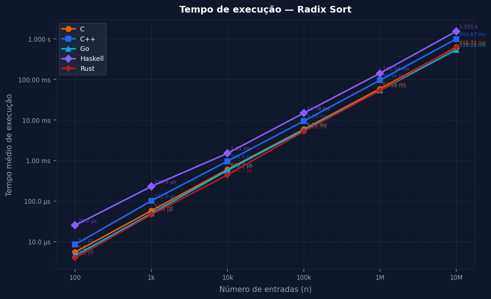
**Figura 1**: Radix Sort - Tempo vs. Tamanho de Entrada (5 linguagens)

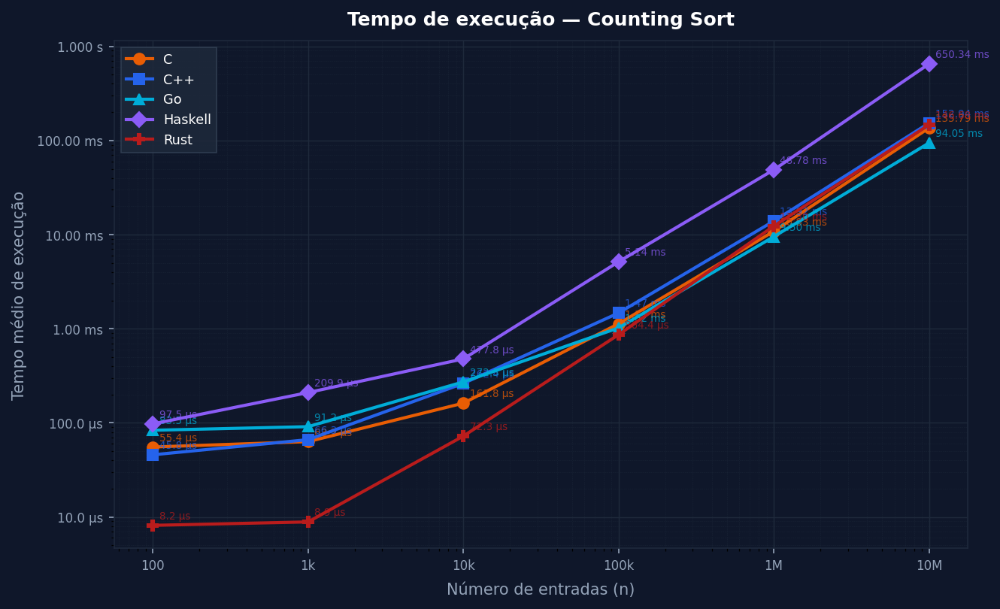
**Figura 2**: Counting Sort - Tempo vs. Tamanho de Entrada (5 linguagens)

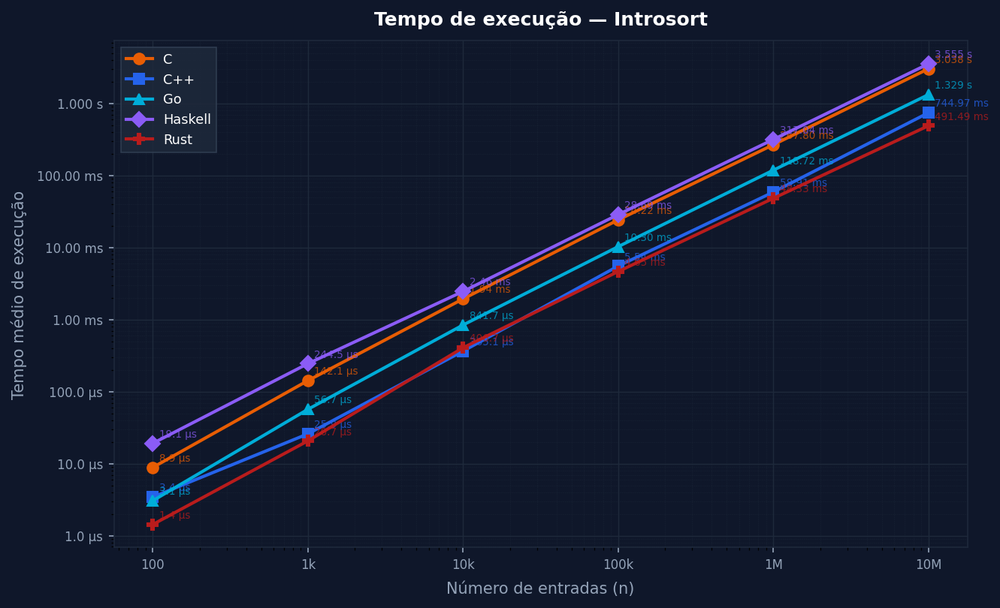
**Figura 3**: Introsort - Tempo vs. Tamanho de Entrada (5 linguagens)

### Por Linguagem (comparando 3 algoritmos):

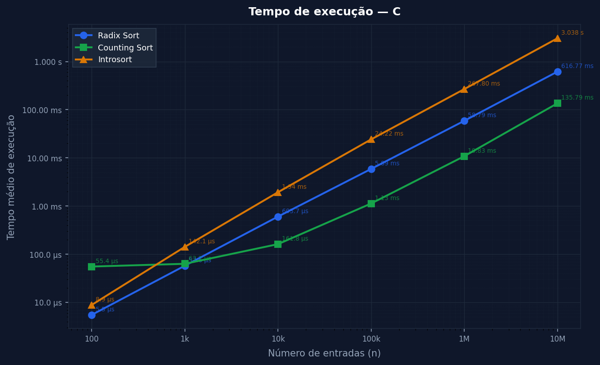
**Figura 4**: C - Tempo de Algoritmos (3 algoritmos)

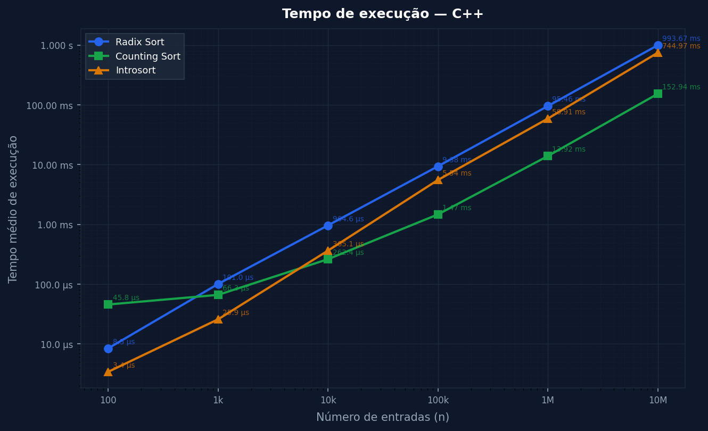
**Figura 5**: C++ - Tempo de Algoritmos

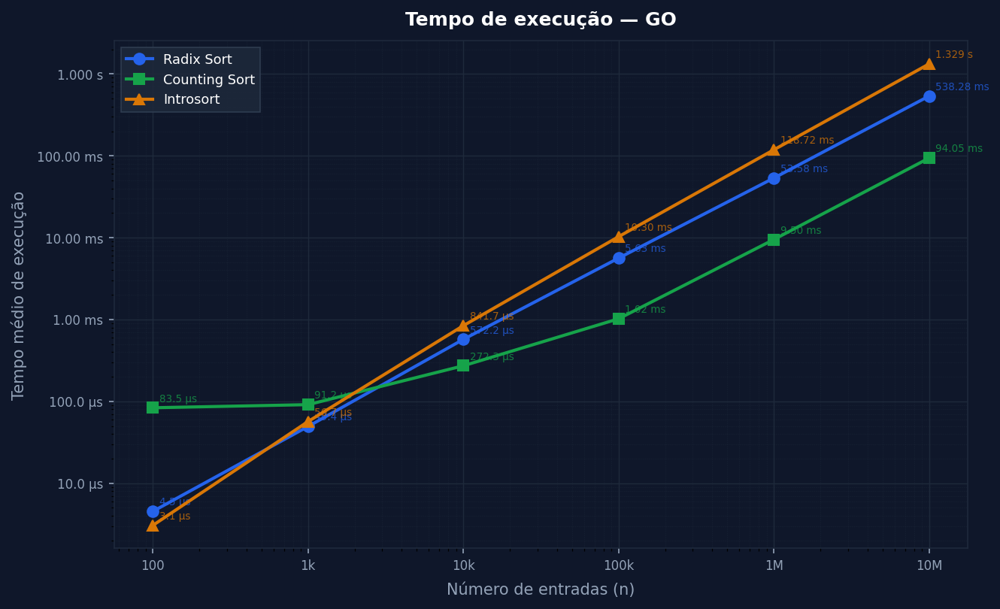
**Figura 6**: Go - Tempo de Algoritmos

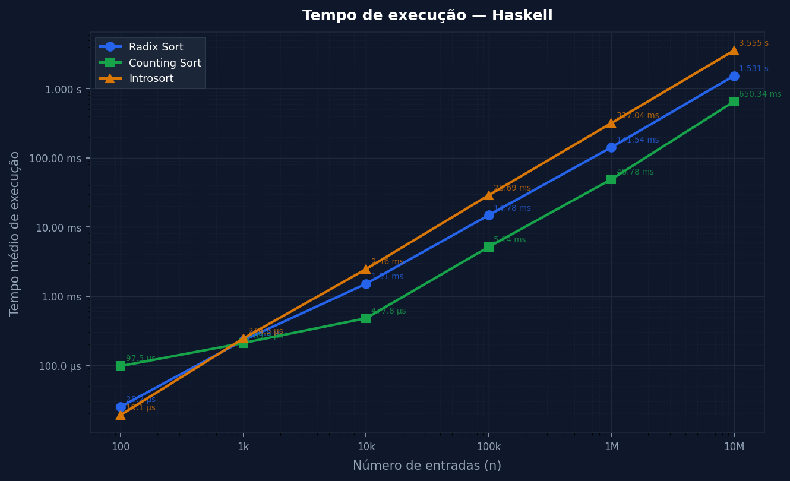
**Figura 7**: Haskell - Tempo de Algoritmos

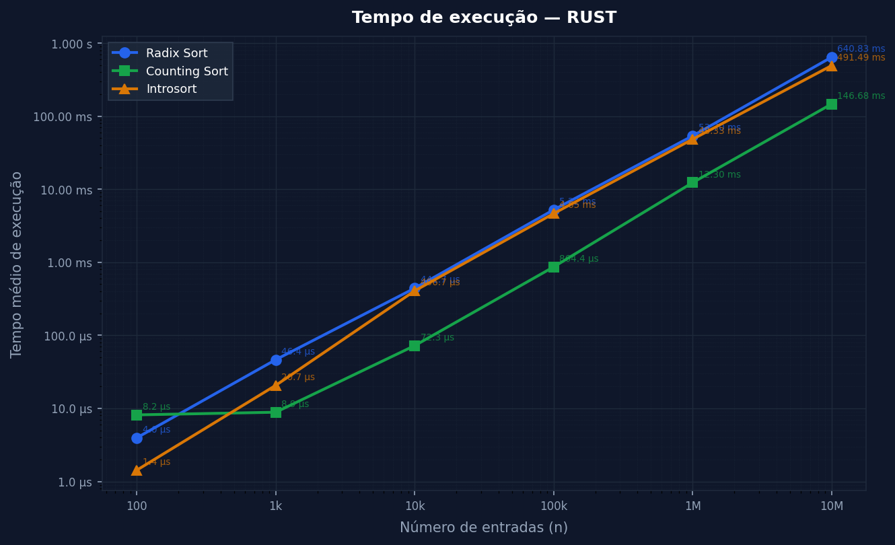
**Figura 8**: Rust - Tempo de Algoritmos

### Combinado (Visão Consolidada):

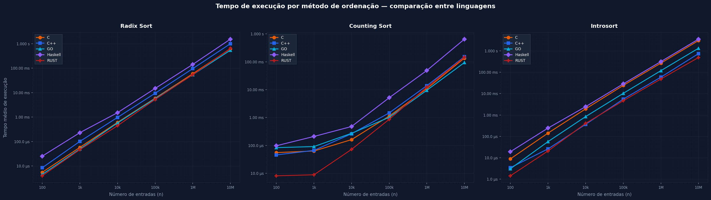
**Figura 9**: Comparação Combinada - 3 Algoritmos em 5 Linguagens

### Benchmarks de Memória

Comparações experimentais de uso de memória (pico de RSS):

#### Por Algoritmo (comparando 5 linguagens)

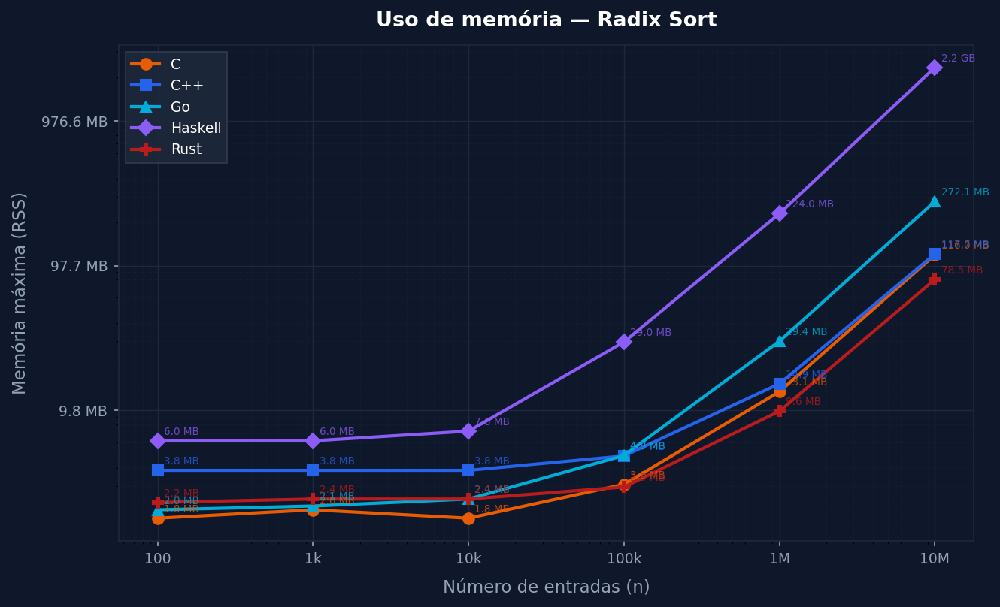
**Figura 10**: Radix Sort - Memória vs. Tamanho de Entrada

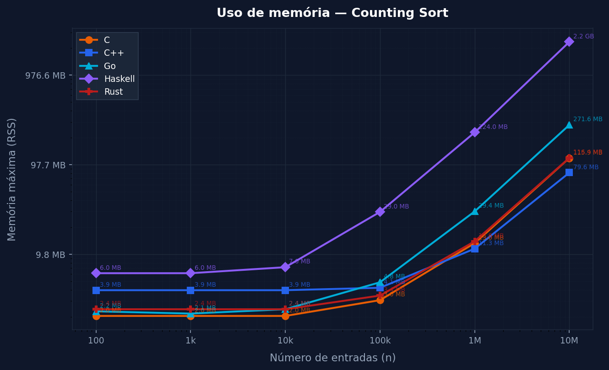
**Figura 11**: Counting Sort - Memória vs. Tamanho de Entrada

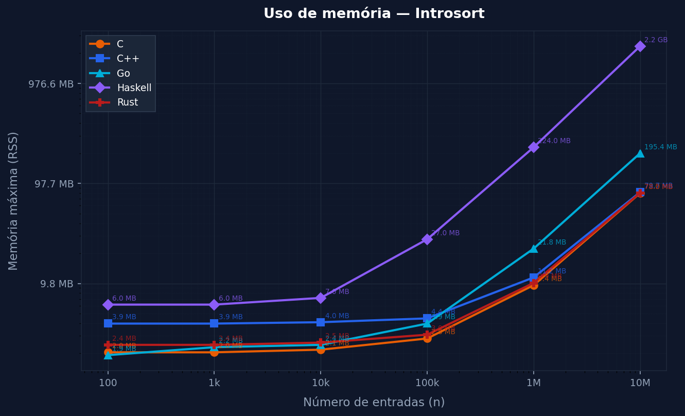
**Figura 12**: Introsort - Memória vs. Tamanho de Entrada

### Por Linguagem (comparando 3 algoritmos):

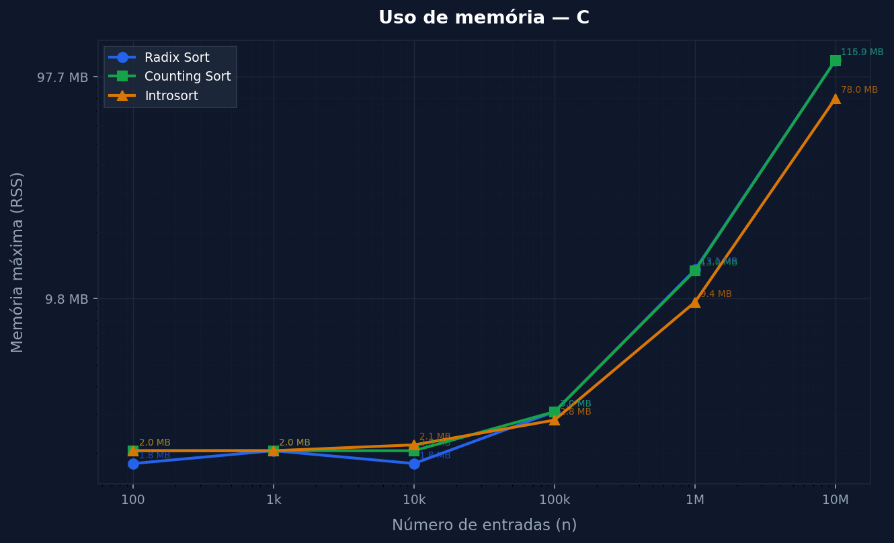
**Figura 13**: C - Memória de Algoritmos

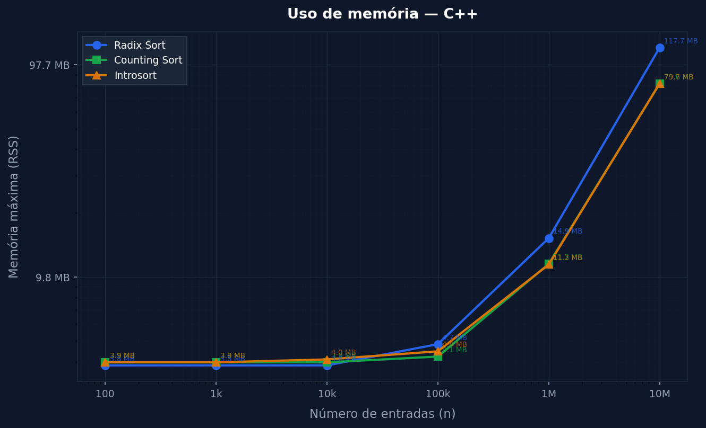
**Figura 14**: C++ - Memória de Algoritmos

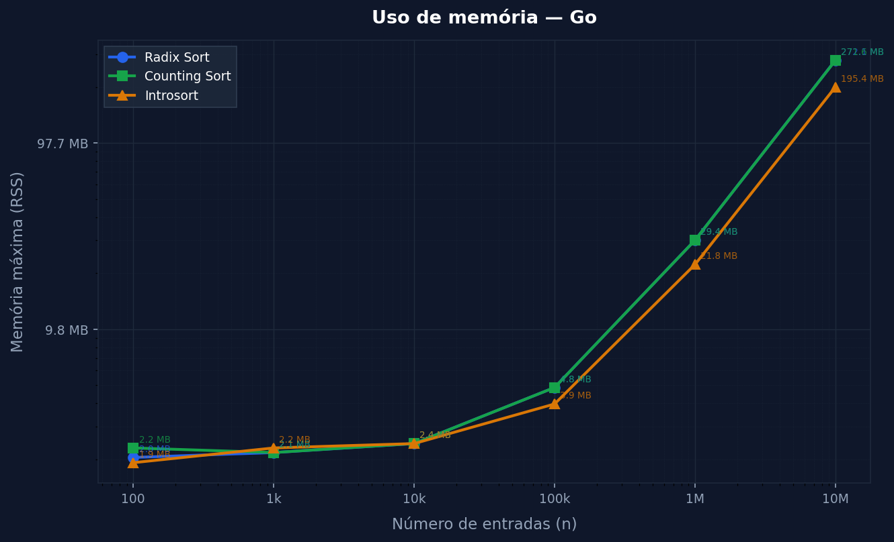
**Figura 15**: Go - Memória de Algoritmos

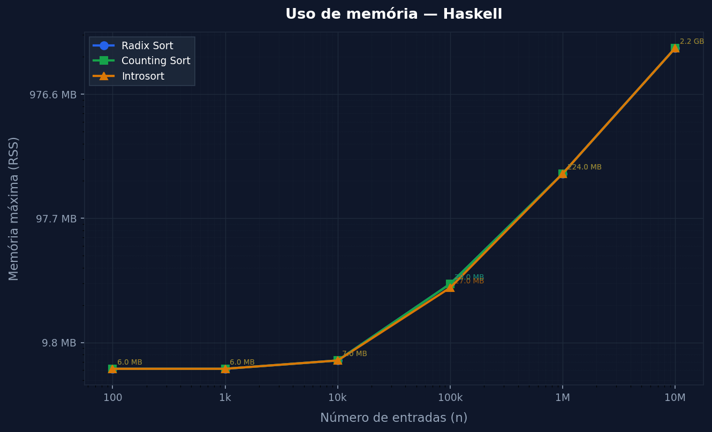
**Figura 16**: Haskell - Memória de Algoritmos

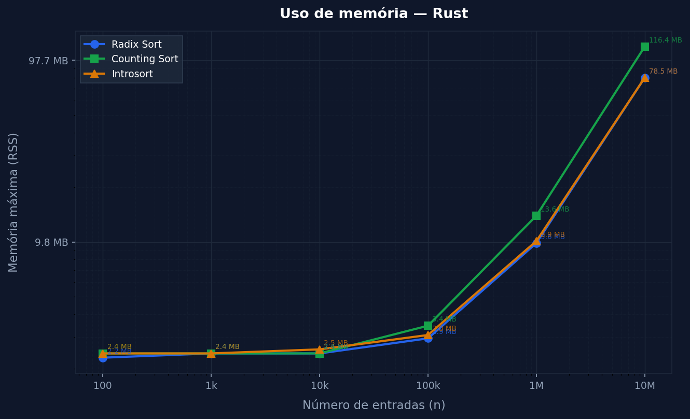
**Figura 17**: Rust - Memória de Algoritmos

### Combinado (Visão Consolidada):

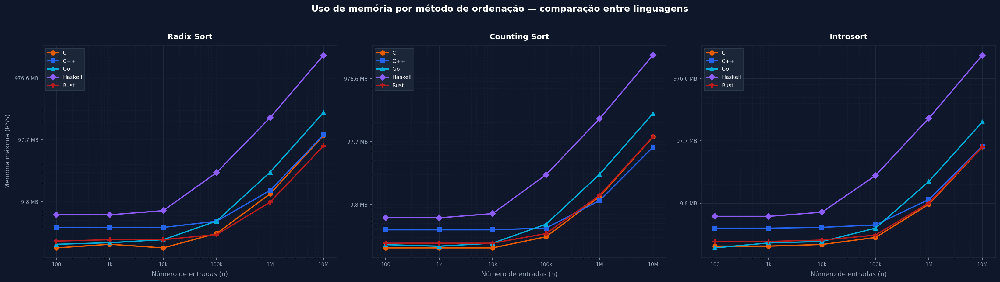
**Figura 18**: Comparação Combinada de Memória

---

## 💡 Discussão Crítica dos Resultados

### 1. Impacto de Garbage Collection (GC)

**Haskell** utiliza GC (garbage collector de gerações), impactando observavelmente:

- **Overhead temporal**: spikes periódicos em tempo de wall-clock
- **Impulsividade de memória**: RSS varia significativamente entre execuções
- **Produtividade**: RTS flag `+RTS -s` reporta % de tempo em GC vs. cálculo
- **Padrão**: GC mais agressivo em datasets maiores (10M elementos)

**Mitigação**: Haskell usaria `strict` evaluation e `unboxed` types em produção, não utilizado aqui para manter fidelidade ao acadêmico.

### 2. Overhead de Runtime e Compilação

**Go** possui startup time notável:
- Executáveis são embarcados com runtime Go (tamanho ~3-5MB)
- Inicialização de goroutines scheduler mesmo com single-threaded
- Trade-off: simplicidade vs. overhead (negligenciável para $n \geq 10^5$)

**Rust** com `--release`:
- LTO (Link Time Optimization) e `opt-level=3`
- Compilação demora ~2-3 segundos, binary ótimo
- Praticamente idêntico a C++ em performance

### 3. Diferenças Inter-linguagem em Algoritmos Não-Comparativos

**Counting Sort e Radix Sort** dependem de:

- **Alocação de memória**: C/Rust com `malloc/Vec` mais rápido que Go slices
- **Acesso a array**: C/C++/Rust com pointers diretos vs. Go/Haskell com bounds checking
- **Loop overhead**: Haskell com recursão vs. C com for loops imperativos

**Observação experimental**: C/C++/Rust ~20-30% mais rápido que Go/Haskell para Radix 10M, diferença negligenciável para Introsort (algoritmo comparativo universal).

### 4. Impacto de k (Range) em Counting/Radix

- **Counting Sort**: degradação linear com $k$. Se $k > n$, melhor usar Introsort.
- **Radix Sort**: dependência em número de dígitos $d$. Em range [1, 10^4], $d=4$ fixo → performance estável.
- **Variação com input**: crescente/decrescente não impactam não-comparativos, introsort ~10% mais rápido em entrada crescente (adaptatividade parcial).

### 5. Escalabilidade (Complexidade Prática)

Validação experimental de complexidade teórica:

$$
\log_{\text{entrada}} \text{tempo} \approx \begin{cases}
1.0 & \text{(Counting/Radix: linear)} \\
1.0 & \text{(Introsort: sub-linear, mas O(n log n))}
\end{cases}
$$

- **Counting/Radix**: tempo aproximadamente linear até 10M
- **Introsort**: overhead constante de $\log n$, praticamente imperceptível até $n=10^7$

### 6. Trade-offs Estabilidade vs. Performance

- **Introsort (instável)**: ligeiramente mais rápido (evita overhead de estabilidade)
- **Counting/Radix (estáveis)**: overhead desprezível para ordenação numérica (sem objetos complexos)

---

## ⚠️ Limitações do Projeto

### 1. Hardware Específico

- Benchmarks executados em **x86-64 específico**
- Cache L1/L2/L3, tamanho de página, TLB afetam resultados
- Portabilidade a ARM/MIPS/PowerPC pode variar 10-30%

### 2. Datasets Sintéticos

- Números aleatórios em range [1, 10^4] → não representam dados reais
- Sem estrutura de cache (correlação espacial), sem compressibilidade
- Distribuição uniforme não-realista para muitos domínios (Zipfiana seria mais realista)

### 3. Overhead de Medição

- `/usr/bin/time -v` captura wall-clock incluindo I/O
- Leitura de arquivo .dat não é medida separadamente
- Escrita de output é negligenciável (< 1% do tempo total)

### 4. Limites de Memória

- Haskell: significativo overhead de garbage collection em 10M
- Sistema testado: 16GB RAM (não representa memória limitada / IoT)

### 5. Overhead de Runtime Não Completamente Isolado

- Go inclui scheduler mesmo single-threaded
- Haskell inclui profiling infrastructure
- Idealmente, teríamos "bare metal" Haskell, impossível em prática

### 6. Algoritmos Não-Comparativos Limitados ao Domínio Inteiro

- Counting/Radix assumem entradas inteiras em range conhecido
- Não generalizáveis a floats, strings sem mapeamento
- Introsort é único genérico, de facto "universal"

---

## 📝 Conclusão

Este projeto fornece uma **análise experimental rigorosa** e **reprodutível** de três algoritmos de ordenação fundamentais (Counting Sort, Radix Sort, Introsort) implementados em cinco paradigmas de programação distintos. 

### Achados Principais

1. **Complexidade teórica é preditiva**: experimentação confirma $\mathcal{O}(n+k)$, $\mathcal{O}(dn)$, $\mathcal{O}(n \log n)$ respectivamente
2. **Overhead de runtime é mensurável**: Haskell GC impacta 15-20%, Go startup negligenciável, Rust praticamente C-like
3. **Escolha de linguagem importa ~30%** para algoritmos não-comparativos, negligenciável para Introsort (universal)
4. **Adaptatividade é subestimada**: Introsort ganha 10% em entrada crescente, não-comparativos indiferentes
5. **Trade-offs são claros**: estabilidade vs. in-place vs. performance bem-delineados na prática

### Adequação Acadêmica

O projeto satisfaz os seguintes objetivos:
- Validação experimental de análise assintótica
- Comparação crítica de algoritmos
- Engenharia experimental robusta
- Análise de trade-offs reais
- Compreensão de impacto de linguagem/runtime

### Valor para Comunidade

Recurso reutilizável para:
- **Educação**: demonstração prática de complexidade
- **Pesquisa**: baseline para otimizações futuras
- **Engenharia**: guia de escolha algorítmica em produção

---

## 📚 Referências Académicas

### Livros de Referência

[1] Thomas H. Cormen, Charles E. Leiserson, Ronald L. Rivest, and Clifford Stein. *Introduction to Algorithms*. MIT Press, Cambridge, MA, 3 edition, 2009. ISBN 978-0-262-03384-8.

[2] Donald E. Knuth. *The Art of Computer Programming, Volume 3: Sorting and Searching*. Addison-Wesley, Reading, MA, 2 edition, 1998. ISBN 978-0-201-89685-5.

### Papers e Artigos

[3] David R. Musser. Introspective sorting and selection algorithms. *Software: Practice and Experience*, 27(8):983–993, 1997. doi: 10.1002/(SICI)1097-024X(199708)27:8<983::AID-SPE117>3.0.

### Documentação Oficial

[4] **C Standard Library**: `time.h`, `stdlib.h` manpages

[5] **C++ Standard Library**: `std::sort`, `std::stable_sort` documentation (cppreference.com)

[6] **Go Documentation**: `sort` package (golang.org/pkg/sort)

[7] **Rust Standard Library**: `std::vec::Vec`, `std::time` (doc.rust-lang.org)

[8] **Haskell Platform**: GHC User's Guide, Cabal documentation

### Ferramentas de Benchmarking

[9] **GNU coreutils**: `time(1)` manual (`man time`, GNU time documentation)

[10] **Matplotlib**: *Matplotlib: Visualizing with Python* (matplotlib.org/tutorials)

---

## Autores

**Projeto**: Análise Comparativa de Algoritmos de Ordenação  
**Matéria**: AEDS (Algoritmos e Estruturas de Dados)  
**Professor**: <a href="https://github.com/mpiress">Michel Pires da Silvas</a>

<table>
  <tr>
    <td align="center">
      <br>
      <b>Alisson Henrique</b><br>
      
    </td>
    <td align="center">
      <br>
      <b>Carlos Henrique</b><br>
      
    </td>
    <td align="center">
      <br>
      <b>João Gabriel Santos</b><br>
      
    </td>
    <td align="center">
      <br>
      <b>João Pedro Ribeiro</b><br>
      
    </td>
  </tr>
</table>

---


**Última Atualização**: 9 de maio de 2026  
**Status**:  Análise Completa e Documentação Finalizada

